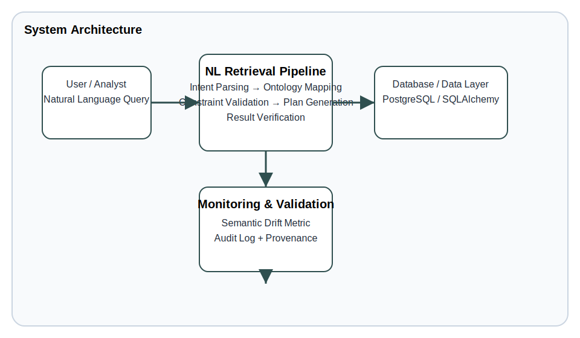
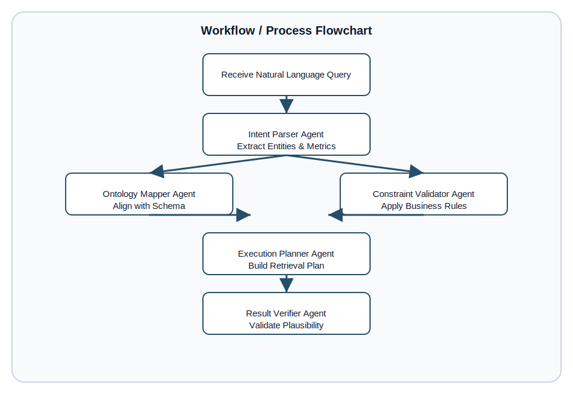
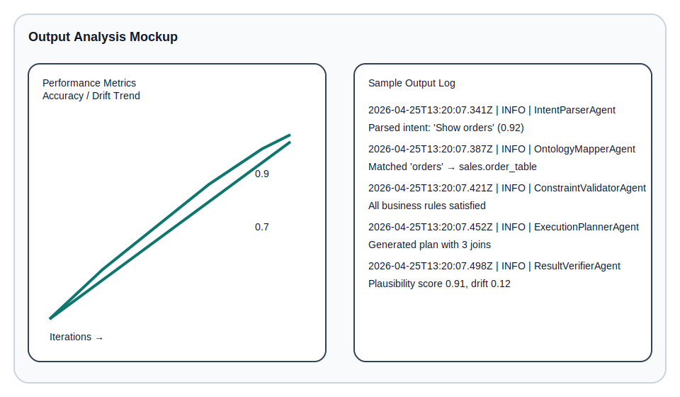
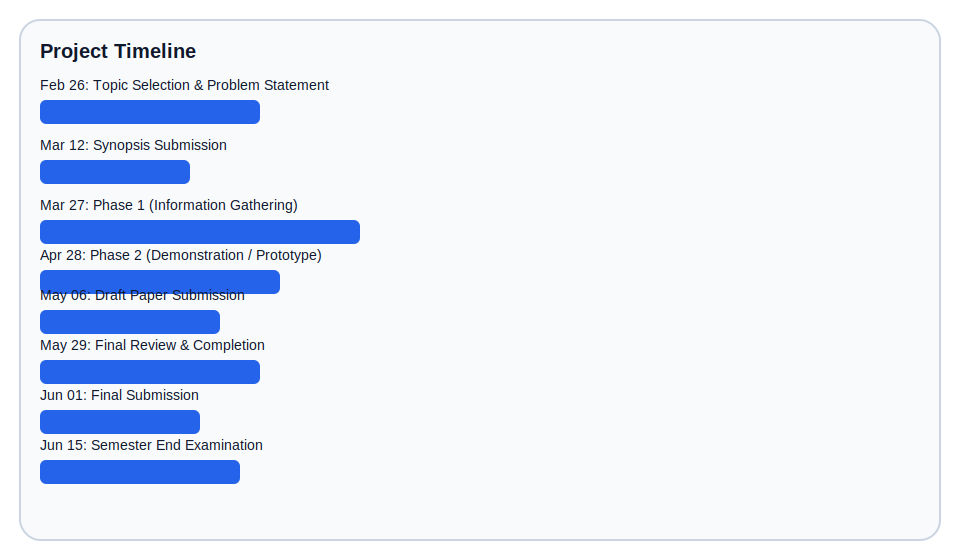

# Project Foundation & Technical Architecture

## 1. Project Foundation & Scope

### Problem Domain
This project addresses the need for a secure, explainable, and constraint-driven natural language data retrieval system that removes direct SQL exposure for end users.

Pain points:
- Business users cannot safely query data without SQL expertise.
- Raw SQL access leads to compliance, injection, and auditability risks.
- Existing NL-to-SQL layers are brittle and often fail silently on complex business rules.
- Enterprises need traceable decision paths, semantic validation, and governance-ready query behavior.

Necessity of a solution:
- Provide a reliable interface for business analysts to ask questions in natural language.
- Enforce business constraints before data access, avoiding incorrect or noncompliant outputs.
- Maintain full query provenance, drift detection, and explanation for each generated retrieval plan.

### Literature Review
The current literature and state-of-the-art include:
- Natural Language Interfaces to Databases (NLIDB) research such as Seq2SQL, SQLNet, and Spider benchmarks.
- Transformer-based semantic parsing models applied to structured query generation.
- Agentic orchestration and pipeline architectures for decomposing complex language tasks.
- Semantic grounding and ambiguity resolution through ontology-aware query mapping.
- Drift detection and model calibration metrics for safe retrieval systems.

Research gaps this project bridges:
- Most NL-to-SQL systems still expose raw SQL or produce unverifiable queries.
- Existing solutions rarely integrate business rules and constraint validation as a first-class stage.
- There is limited research on multi-agent orchestration with continuous semantic drift feedback during NL data retrieval.
- Few practical systems combine query provenance, plausibility scoring, and structured result verification.

### Justification
This project is relevant because:
- Industry demand is rising for self-service analytics tools that do not compromise governance.
- Academic research continues to emphasize safe, explainable data access over pure accuracy.
- The project aligns with the trend toward constrained AI systems where outputs are validated by domain rules.
- It provides a research-backed bridge between conversational analytics and enterprise-ready retrieval engines.

## 2. Technical Architecture & Methodology

### Technical Deep Dive
The system uses a modular, multi-agent pipeline to convert natural language into a verified, executable retrieval plan.

Core concepts:
- **Intent parsing** extracts entities, metrics, and query intent from unstructured language.
- **Ontology mapping** matches extracted concepts to a curated domain schema so retrieved data is semantically grounded.
- **Constraint validation** applies business rules and governance checks before execution.
- **Execution planning** builds parameterized retrieval plans rather than exposing raw SQL strings.
- **Result verification** scores output plausibility and checks anomalies against historical baselines.
- **Semantic drift metric** tracks how far a candidate interpretation deviates from expected intent, ontology alignment, and rule compliance.

Mathematical model example:
- Intent alignment: cosine similarity between extracted intent embeddings and ontology node embeddings.
- Constraint adherence: ratio of satisfied constraints to total applicable rules.
- Plausibility score: normalized z-score or anomaly detection measure relative to baseline query patterns.
- Composite drift: 0.4×(1 − alignment) + 0.3×(1 − adherence) + 0.3×(1 − plausibility).

### Tooling & Frameworks
| Category | Technologies |
|---|---|
| Language | Python 3.11 / 3.12 |
| Backend | FastAPI, Uvicorn |
| API | Pydantic |
| Orchestration | Custom agent pipeline, LangGraph-style flow |
| Data | PostgreSQL, SQLAlchemy |
| ML / NLP | Embedding similarity, semantic parsing heuristics |
| Testing | pytest |
| Deployment | Docker, docker-compose |
| Monitoring | Structured JSON logging, trace records |

### Design Justification
Chosen architecture:
- A modular, pipeline-oriented design with independent agent stages.
- A single backend service for API and orchestration, with the option to split into microservices later.

Why this approach:
- **Modular pipeline** allows each stage to be validated independently and extended with new business logic.
- **Monolithic backend** initially simplifies deployment and debugging while still enabling service separation later.
- **Constraint-driven retrieval** is safer than black-box end-to-end transformation.
- **Ontology grounding** brings stronger semantic correctness than pure sequence-to-sequence SQL generation.
- Alternatives such as a pure microservice architecture or a generic transformer-based NL-to-SQL model would either add unnecessary deployment complexity or reduce explainability.

## 3. Visualizations & Diagram Requests

### Architecture Design


### Workflow / Process Flowchart


### Output Analysis


#### Example Output Log
```
2026-04-25T13:20:07.341Z | INFO  | IntentParserAgent | Parsed intent: 'Show orders' (confidence=0.92)
2026-04-25T13:20:07.387Z | INFO  | OntologyMapperAgent | Matched entity 'orders' -> sales.order_table.order_id
2026-04-25T13:20:07.421Z | INFO  | ConstraintValidatorAgent | All applicable rules satisfied
2026-04-25T13:20:07.452Z | INFO  | ExecutionPlannerAgent | Generated retrieval plan with 3 joins
2026-04-25T13:20:07.498Z | INFO  | ResultVerifierAgent | Plausibility score 0.91, drift 0.12
2026-04-25T13:20:07.523Z | INFO  | QueryExecution | Completed in 182ms
```

### Project Timeline


---

## Appendix: Milestones
- Feb 26: Topic Selection & Problem Statement
- Mar 12: Synopsis Submission
- Mar 27: Phase 1 (Information Gathering)
- Apr 28: Phase 2 (Demonstration / Prototype)
- May 06: Draft Paper Submission
- May 29: Final Review & Completion
- Jun 01: Final Submission
- Jun 15: Semester End Examination
